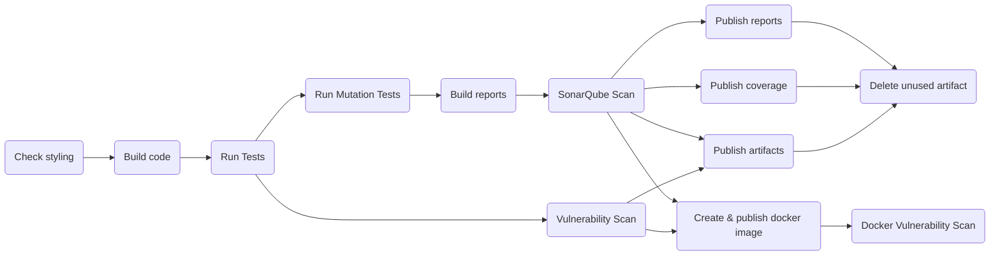

# E-Comm CI/CD workflows and actions

## CI pipeline

```mermaid
flowchart LR
  A(Check styling)
  B(Build code)
  C(Run Tests)
  D(Run Mutation Tests)
  E(Build reports)
  F(SonarQube Scan)
  G(Vulnerability Scan)
  H(Publish coverage)
  I(Create & publish docker image)
  J(Publish artifacts)
  K(Publish reports)
  L(Delete unused artifact)
  M(Docker Vulnerability Scan)
  A --> B
  B --> C
  C --> D
  D --> E
  E --> F
  C --> G
  F --> H
  F --> I
  F --> K
  K --> L
  G --> I
  F --> J
  G --> J
  H --> L
  J --> L
  I --> M
```
