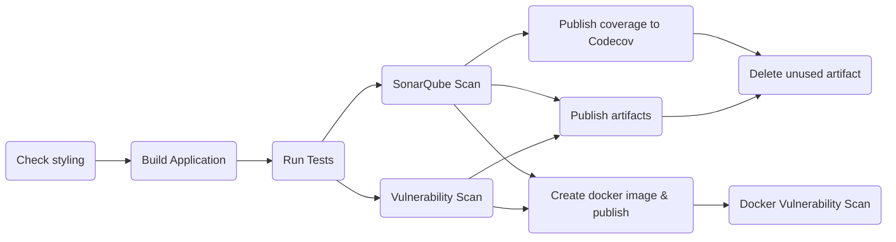

# E-Comm CI/CD workflows and actions

```mermaid
flowchart LR
  A(Check styling)
  B(Build Application)
  C(Run Tests)
  D(SonarQube Scan)
  E(Vulnerability Scan)
  F(Publish coverage to Codecov)
  G(Create docker image & publish)
  H(Publish artifacts)
  I(Delete unused artifact)
  J(Docker Vulnerability Scan)
  A --> B
  B --> C
  C --> D
  C --> E
  D --> F
  D --> G
  E --> G
  D --> H
  E --> H
  F --> I
  H --> I
  G --> J
```

